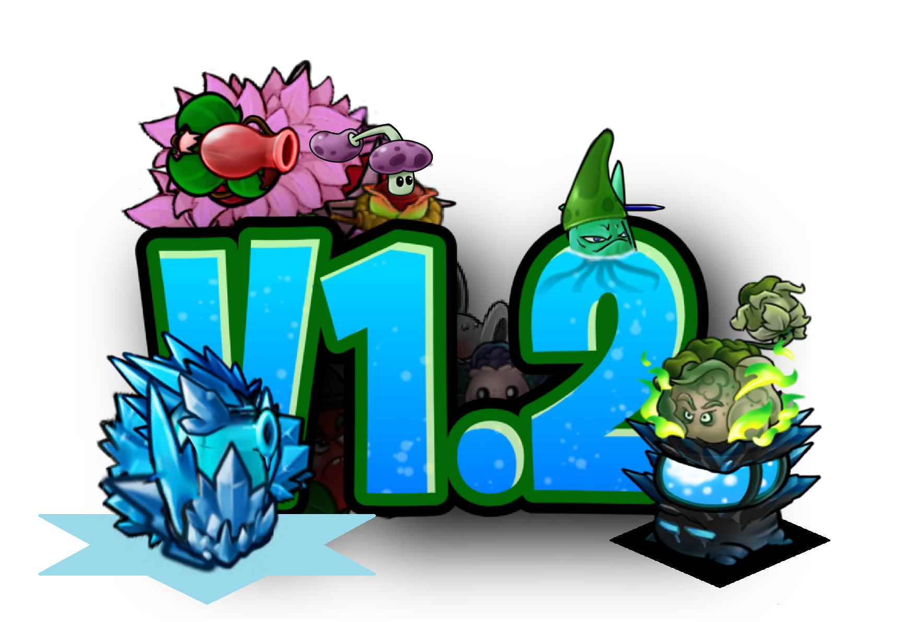

# Plants+

<<<<<<< Updated upstream
**Plants+** is a content mod for **Plants vs. Zombies Fusion 3.8.1**. Version **1.1.1** contains twenty custom plants, original mechanics, Almanac entries, fusion and conversion recipes, custom prefabs, Odyssey support, editor improvements and new menu presentation.

> MelonLoader build string: `1.1.1-ml.13`

=======
**Plants+** is a content mod for **Plants vs. Zombies Fusion 3.8.1**. Version **1.2.0** contains **32 custom plants**, original mechanics, Almanac entries, fusion and conversion recipes, custom prefabs, Odyssey support, Super Level Editor+ additions and custom menu presentation.

>>>>>>> Stashed changes

## Requirements

- Plants vs. Zombies Fusion **3.8.1**
- MelonLoader **0.7.3**
<<<<<<< Updated upstream
- **CustomizeLib.MelonLoader 3.8.1-ml.1** (`CustomizeLib.MelonLoader.dll`)
=======
- **CustomizeLib.MelonLoader 3.8.1**
>>>>>>> Stashed changes

## Plants included

| ID | Plant | Type | Recipe / creation |
|---:|---|---|---|
| 6000 | Lotus Pumpkin | Basic Cross Fusion | Pumpkin + Snow Lotus |
| 6001 | Bambnut | Basic Cross Fusion | Bamblock + Wall-nut |
| 6002 | Magnet-o-pea | Basic Cross Fusion | Peashooter + Magnet-shroom |
| 6003 | Iceberg-shroom | Basic Double Fusion | Ice-shroom + Ice-shroom |
| 6004 | Witchfire Pumpkin | Weak Odyssey | Pyro Pumpkin + Doom Pumpkin |
| 6005 | Nutty Sharpshooter | Basic Cross Fusion | Spruce Sharpshooter + Wall-nut |
| 6006 | Inferno Torchflower | Advanced Alt | Infernowood + Sunflower |
| 6007 | Pumpkin Podbomber | Advanced Alt | Explode-o-shooter + Pumpkin |
| 6008 | Ceasarweed | Advanced Alt | Salad-pult + Spikeweed |
| 6009 | Solar Firnace | Special Cross Fusion | Firnace absorbs the Sunflower below it |
| 6010 | Not-a-pea | Basic Fusion | Saw-me-not + Peashooter |
| 6011 | Not-a-storm Commando | Strong Odyssey | Saw-me-not + Pea-storm Commando |
| 6012 | Frost Furflower | Advanced Fusion | Hoarfrost Lichen + Sunflower |
| 6013 | Doomtronion | Electric Fusion | Amp-nion + Doom-shroom |
| 6014 | Lichen-pea | Basic Fusion | Hoarfrost Lichen + Peashooter |
| 6015 | Logic Blover | Harvest Red Card | Harvest-exclusive; no fusion recipe |
| 6016 | Solar Sharpshooter | Basic Fusion | Spruce Sharpshooter + Sunflower |
| 6017 | Sea Ballista | Aquatic Fusion | Spruce Ballista + Sea-shroom |
| 6018 | Pineshooter | Basic Fusion | Peashooter + Spruce Sharpshooter |
| 6019 | Icytronion | Electric Fusion | Amp-nion + Ice-shroom |
| 6020 | Sea Sharpshooter | Aquatic Fusion | Spruce Sharpshooter + Sea-shroom |
| 6021 | Cherry StarBomber | Epic Odyssey | Starfruit + Peashooter |
| 6022 | Three-Buckpeater | Basic Fusion | Threepeater + Bucket |
| 6023 | Sakura Sharpshooter | Basic Fusion | Cherry Bomb + Spruce Sharpshooter |
| 6025 | Bomber Drone | Basic Fusion | Cherryshooter + Blover |
| 6031 | Frostbite Drone | Basic Fusion | Snow Pea + Blover |
| 6026 | Ice-Lord Cactus | Odyssey | Ice Cactus + Iceberg-shroom |
| 6027 | Scovilia Pepper | Basic Fusion | Jalapeno + Jalapeno |
| 6028 | Atomray-shroom | Odyssey | Plantern ↔ Fume-shroom |
| 6029 | Sauerkraut-pult | Odyssey | Garbage-pult + Pepper Popper |
| 6030 | Cherry Cabbage | Basic Fusion | Cherry Bomb + Cabbage-pult |
| 6032 | Lob-shroom | Basic Fusion | Custom / stackable spore lobber |

ID **6024** is reserved for **Boreal Orchid**, which was delayed and is not part of v1.2.0.

## Highlights in v1.2

- Twelve new plants, from Sea Sharpshooter through Lob-shroom.
- Sea Sharpshooter grows through three stronger aquatic stages.
- Cherry StarBomber launches two explosive Cherry Star volleys and supports Odyssey modifiers.
- Three-Buckpeater attacks three lanes with iron peas.
- Sakura Sharpshooter combines explosive thorns with Explode-o-shooter chain reactions.
- Bomber Drone and Frostbite Drone add two hovering support shooters.
- Ice-Lord Cactus changes its attack against ground and airborne zombies.
- Scovilia Pepper burns three lanes at once.
- Atomray-shroom mixes a slowing ray with Demise-shroom effects.
- Sauerkraut-pult changes attack mode based on zombie distance.
- Cherry Cabbage becomes more dangerous as zombies approach the house.
- Lob-shroom is a stackable arcing spore shooter.
- Night Roof is available in Super Level Editor+.
- New v1.2 main-menu logo and in-game changelog.

## Installation

<<<<<<< Updated upstream
1. Install MelonLoader 0.7.3 for PVZ Fusion 3.8.1.
2. Put `CustomizeLib.MelonLoader.dll` in the game's `Mods` folder.
3. Remove older copies of `PlantsPlus.dll`.
4. Put `PlantsPlus.dll` from the GitHub release in the game's `Mods` folder.
5. Start the game and look for `Plants+ 1.1.1-ml.13 loaded!` in the MelonLoader log.
=======
1. Install MelonLoader for PvZ Fusion 3.8.1.
2. Put `CustomizeLib.MelonLoader.dll` in the game's `Mods` folder.
3. Remove older copies of `PlantsPlus.dll`.
4. Put the v1.2 `PlantsPlus.dll` in the game's `Mods` folder.
5. Start the game and check that `Plants+ 1.2.0 loaded!` appears in the MelonLoader log.
>>>>>>> Stashed changes

## Documentation

- [Plant mechanics](docs/PLANTS.md)
- [Building from source](docs/BUILDING.md)
- [Changelog](CHANGELOG.md)
- [French README](README_FR.md)

## Building

The project targets `.NET 6` and references the assemblies generated by MelonLoader. Game assemblies and CustomizeLib are not redistributed in this repository.

## Reporting bugs

Open an issue and attach the complete MelonLoader log. Include the plant, recipe and steps that produced the problem.

## Credits

- Mod creator and plant concepts: **Auro**
- Plant and fusion artwork: **Red Reel** and **Retrosphere**
<<<<<<< Updated upstream
- Built for the PvZ Fusion modding community using the MelonLoader port of CustomizeLib
=======
- Preview video editing: **Mathys**
- Built for the PvZ Fusion modding community using CustomizeLib
>>>>>>> Stashed changes

## Disclaimer

Plants+ is a fan-made, unofficial mod. It is not affiliated with or endorsed by Electronic Arts, PopCap Games or the PvZ Fusion developers. Plants vs. Zombies and related names belong to their respective owners.
