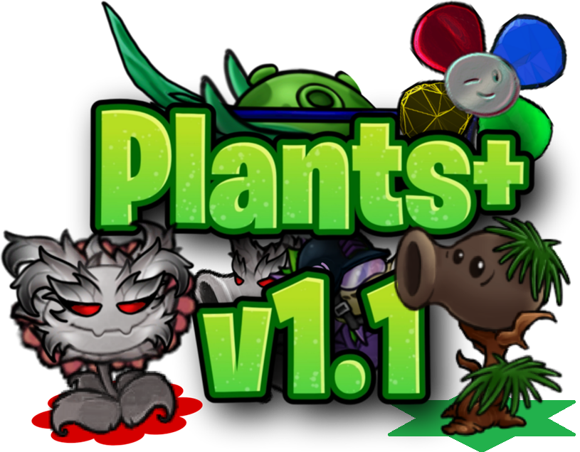

# Plants+

**Plants+** est un mod de contenu pour **Plants vs. Zombies Fusion 3.8**. La version **1.1.0** contient vingt plantes personnalisées, leurs mécaniques originales, fiches d'Almanach, recettes de fusion et de conversion, prefabs, compatibilité Odyssey, améliorations de l'éditeur et nouveaux éléments de menu.

> Version interne MelonLoader : `1.1.0-ml.3`

## Prérequis

- Plants vs. Zombies Fusion **3.8**
- MelonLoader **0.7.3**
- Le port MelonLoader de **CustomizeLib 3.8** (`CustomizeLib.BepInEx.dll`)

## Plantes incluses

| ID | Plante | Type | Recette / création |
|---:|---|---|---|
| 6000 | Lotus Pumpkin | Basic Cross Fusion | Pumpkin + Snow Lotus |
| 6001 | Bambnut | Basic Cross Fusion | Bamblock + Wall-nut |
| 6002 | Magnet-o-pea | Basic Cross Fusion | Peashooter + Magnet-shroom |
| 6003 | Iceberg-shroom | Basic Double Fusion | Ice-shroom + Ice-shroom |
| 6004 | Witchfire Pumpkin | Weak Odyssey | Pyro Pumpkin + Doom Pumpkin |
| 6005 | Nutty Sharpshooter | Basic Cross Fusion | Spruce Sharpshooter + Wall-nut |
| 6006 | Inferno Torchflower | Advanced Alt | Infernowood + Sunflower |
| 6007 | Pumpkin Podbomber | Advanced Alt | Explode-o-shooter + Pumpkin |
| 6008 | Ceasarweed | Advanced Alt | Salad-pult + Spikeweed |
| 6009 | Solar Firnace | Special Cross Fusion | Firnace absorbe le Sunflower placé dessous |
| 6010 | Not-a-pea | Basic Fusion | Saw-me-not > Peashooter |
| 6011 | Not-a-storm Commando | Strong Odyssey | Saw-me-not > Pea-storm Commando |
| 6012 | Frost Furflower | Advanced Fusion | Hoarfrost Lichen > Sunflower |
| 6013 | Doomtronion | Electric Fusion | Amp-nion > Doom-shroom |
| 6014 | Lichen-pea | Basic Fusion | Hoarfrost Lichen > Peashooter |
| 6015 | Logic Blover | Harvest Red Card | Exclusif au Harvest ; aucune recette |
| 6016 | Solar Sharpshooter | Basic Fusion | Spruce Sharpshooter > Sunflower |
| 6017 | Sea Ballista | Aquatic Fusion | Spruce Ballista > Sea-shroom |
| 6018 | Pineshooter | Basic Fusion | Peashooter > Spruce Sharpshooter |
| 6019 | Icytronion | Electric Fusion | Amp-nion > Ice-shroom |

Tous les IDs personnalisés utilisent la plage 6000 afin d'éviter la plage native déjà occupée dans PVZ Fusion 3.8.

## Nouveautés principales de la v1.1

- Dix nouvelles plantes, de Not-a-pea à Icytronion.
- Refonte d'Inferno Torchflower avec libération du soleil stocké au clic.
- Intégration correcte d'Electronion/Amp-nion dans l'Almanach, Carbon Copy, les cartes et le Sandbox.
- Carte Christmas Snow et aperçus thématiques dans le Super Level Editor.
- Logo Plants+ sur le menu principal et changelog dédié en jeu.
- Nombreux correctifs pour les chaînes électriques, projectiles, animations, ombres, cartes et protections contre le froid.

## Installation

1. Installe MelonLoader 0.7.3 pour PVZ Fusion 3.8.
2. Place le port MelonLoader de `CustomizeLib.BepInEx.dll` dans le dossier `Mods` du jeu.
3. Supprime les anciennes copies de `PlantsPlus.dll`.
4. Place le `PlantsPlus.dll` de la release GitHub dans le dossier `Mods`.
5. Lance le jeu et vérifie la présence de `Plants+ 1.1.0-ml.3 loaded!` dans le log MelonLoader.

## Documentation

- [Mécaniques des plantes](docs/PLANTS_FR.md)
- [Compiler le projet](docs/BUILDING_FR.md)
- [Historique des versions](CHANGELOG.md)
- [README anglais](README.md)

## Compilation

Le projet cible `.NET 6` et référence les assemblies IL2CPP générées par MelonLoader. Les DLL du jeu et CustomizeLib ne sont **pas redistribuées dans ce dépôt**. Consulte [BUILDING_FR.md](docs/BUILDING_FR.md) pour les chemins et commandes nécessaires.

## Signaler un bug

Ouvre une issue avec le modèle de rapport de bug et joins le log MelonLoader complet. Indique la plante, la recette et les étapes exactes qui provoquent le problème.

## Crédits

- Créateur du mod et concepts des plantes : **Auro**
- Dessins des plantes et fusions : **Red Reel** et **Retrosphere**
- Montage des vidéos de présentation : **Mathys**
- Créé pour la communauté de modding PvZ Fusion avec le port MelonLoader de CustomizeLib

## Avertissement

Plants+ est un mod de fan non officiel. Il n'est ni affilié ni approuvé par Electronic Arts, PopCap Games ou les développeurs de PvZ Fusion. Plants vs. Zombies et les noms associés appartiennent à leurs propriétaires respectifs.
